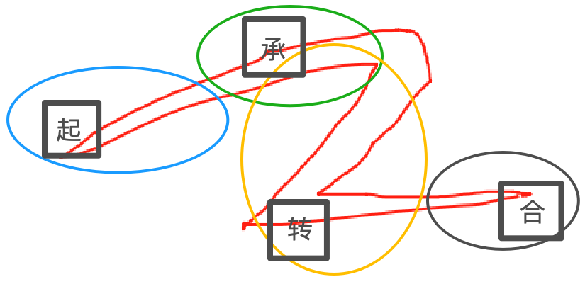

# 如何写一本小说：策划

## 三步创作法

创作一部作品只需要三步：

1. 做好策划
2. 写好大纲，从全书到卷到事件（一个事件 N 章），制定好写作计划
3. 按照计划完成创作

## 策划清单

- 写好 IP 向小说（人设好价值观正面、画面感、强情绪、人物角色集中）
  - 人物
    - 刻画极致人物
    - 用剧情展现有深度的反差人物（多样化、立体化、复杂化）

  - 画面感（空镜+白描+大象跳舞、剔除心理活动作者解说、用动词代替形容词）
    - 空镜：只进行环境描写，无人物、情节
    - 白描：只写可视听的动作、对话，无旁白解释和心理活动
  - 强情绪（情绪不只是喜怒哀乐）
    - 用别人的经历，炸自己的眼腺，莫自嗨，用空镜+白描手法，让读者经历让你爆泪的事件

- 大纲
  - 核心=脑洞（一句话，例如《大泼猴》是升级版《西游记》）
    - 破题（编撰情节、世界观设定，使脑洞成立）
  - 正反阵营角色设计
    - 多视角叙事准备
  - 事件、卷、全书的剧情设计（起承转合）
    - 把握男女频本质（男频是尽可能多的播撒种子，女频是一众追求者中最强且专一）
    - 设计好每一场戏（从高潮逆向拆解，完成每一个起承转合）
  - 爆点
- 创作
  - 写好每一场戏——从高潮逆向拆解
  - 行笔（叙事抛却繁琐、力求打造冲突）
  - 稳住心态（用计划保障作品完成）

## 起承转合示例

“起承转合”是中文叙事结构，类似于故事的开始、发展、转折和结局。具体来说：

- **起**：故事的开始部分，介绍背景和主要事件的开端。
- **承**：故事的发展部分，事件进一步展开。
- **转**：转折点，故事发生意外或变化。
- **合**：结局或解决部分，事件得到解决。

### 作业二：死喜，希波克拉底誓词

林峰被吴院长辞退后，失落地徘徊在街头。突然，他听到一阵急促的喘息声，一名陌生男子倒在地上，面色苍白。围观群众都不敢靠近，而林峰义无反顾地上前施以援手。他失去的是工作，而非希波克拉底誓言，他不能见死不救。【起（开端）】

一名女子气喘吁吁地赶来，看着林峰激动地大喊：“你在干什么？”林峰回答：“我在救他，我是医生！”女子追问：“你怎么证明你是医生？”林峰无法出示证明，这让女子怀疑。女子让他跟着去医院，不许离开。【承（发展）】

4小时后，女子的丈夫终于脱离了危险，医生说：“多亏了及时的心肺复苏，否则连神仙也救不活了。”女子的女儿好奇：“是谁救了我爸爸？”女子回答：“是这位刚被辞退工作的年轻医生林峰。”女儿惊讶：“这么好的大夫，为何被辞退？外公你知道吗？”女儿问吴院长，吴院长瞠目结舌。【转（转折）】

第二天，林峰又回医院上班了。【合（结局）】

