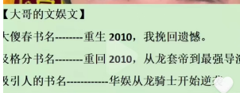
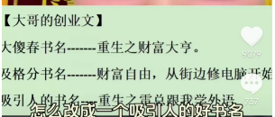
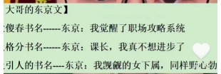
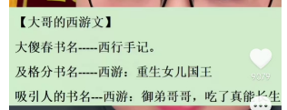

# 如何拟定书名

在起点上，有一些书名既短且朦胧，例如：《大奉打更人》《青山》等。这些书是大神的书，书名基本等同于笔名，大神有固定铁粉，书名起成什么样都有人看。但对于新人，是没有固定读者的，万不可学习拟这些书名。

在起点上，有一些读者是随意找免费书看的。新人的书名要突出亮点、看点、期待感，要想办法吸引免费读者点开这本书，并且要想办法在后面的章节中留住读者。

对新人来说，好的书名没有固定的公式，但有规律。下面是一些好的书名：

《华娱从龙骑士开始逆袭》

《重生之雷总跟我学外语》

《修仙百年，突然发现是低仙》

《东京：我觊觎的女下属，同样野心勃勃》

《西游：御弟哥哥，吃了真能长生》

观察这些书名，有如下规律：

- 读来有意思，有吸引力，这一点最重要
- 题材如果有，放在最前面，后面跟冒号，例如“西游”“东京”。
- 是三段式，或两段式

如果觉得这些长书名low，在起飞后，是可以找编辑改名字的，到时候也可以拥有一个既短又朦胧的书名。

2025年4月11日
