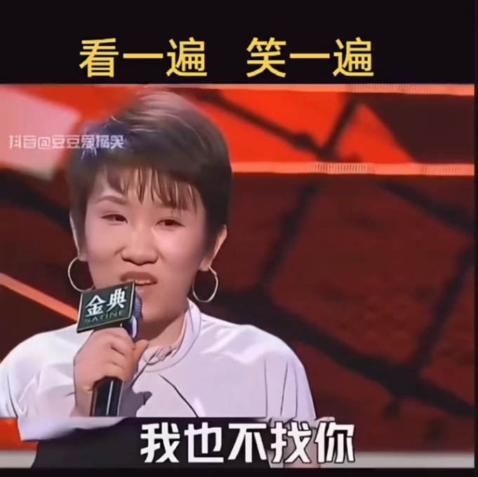

# 写小说什么最重要？

- 信息差的剧烈消失伴随着事物 180 度的转变
- 幽默、搞笑（情节、对白）
- 有料（有知识、有思想）

修辞上的对白幽默

反转：都说我家里藏了 20 吨黄金，我找了一早上也没有找出来

反夸：怎么，只能你一个人当帅哥啊

自嘲：你英语不错！他说的我听不懂，我说的他听不懂。

双关：什么好画？

夸张：我很喜欢小动物的；  

# 有料有心

这不是幽默，但也很重要。一手是幽默，一手是有料，必有所成。

去时百斤重，归来万丈高。（最好的诗句）

 

#  

# 沙雕式的傻笨——信息差无法消除

https://www.douyin.com/user/self?from_tab_name=main&modal_id=7439678779439467787&showTab=favorite_collection 

 

# 大师段子俏皮话（对话）

https://www.douyin.com/user/self?from_tab_name=main&modal_id=7120168566783020319&showTab=favorite_collection 

# 夸张（在直线方向上夸张）

警队为了破案开了一个炸鸡店，结果案子没有破，炸鸡店火了。

https://www.douyin.com/user/self?from_tab_name=main&modal_id=7500538570382347558&showTab=favorite_collection 

 

# 皮影戏信息差

A 以为 B 不知道

A以为B不知道想骗B，其实A在演皮影戏，B是知道的。

# 不相信对方有真实力

唰，刷一下 120。一张烟盒也是 120。

https://www.douyin.com/user/self?from_tab_name=main&modal_id=7302298671486471461&showTab=favorite_collection 

来自男人的倔强，不相信婆儿男的实力

https://www.douyin.com/user/self?from_tab_name=main&modal_id=7465508066486766857&showTab=favorite_collection

 

# 脱口秀故事段子

角色的性格+取向，在一定条件下，做出反常行为，例如：没吃着猪肉，净跟着猪跑了。

“我要是长这样（刘亦菲），我可不找你。”

 

2025.06.10
